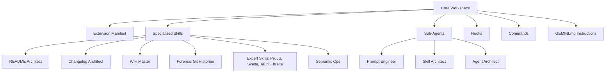

# Gemini Blueprint Workspace

[](https://opensource.org/licenses/Apache-2.0)
[](https://github.com/meyverick/gemini-blueprint)

A state-of-the-art, standard-compliant development environment designed for high-velocity project initialization and consistent architectural enforcement.

## Overview

Modern software engineering requires a cohesive balance between speed and structural integrity. The Gemini Blueprint Workspace eliminates the cognitive overhead of project setup by providing a pre-configured, "batteries-included" ecosystem. It enforces rigorous engineering standards (SOLID, DRY, KISS) and integrates advanced agent-driven workflows out of the box.

## Table of Contents

- [Features](#features)
- [Architecture](#architecture)
- [Getting Started](#getting-started)
- [Project Structure](#project-structure)
- [Documentation Standards](#documentation-standards)
- [Contributing](#contributing)
- [License](#license)

## Features

- **Agentic Workflows:** Integrated sub-agents for prompt engineering, architectural auditing, and automated documentation.
- **Expert Skills:** Specialized workflows for state-of-the-art frameworks including PixiJS, Svelte, Tauri, and Threlte.
- **Semantic Versioning:** First-class support for `sem` operations, enabling entity-oriented reasoning over line-level noise.
- **Automated Governance:** Pre-configured scripts for repository health audits and changelog maintenance.
- **Wiki Integration:** Localized wiki structure for decentralized technical documentation and operational procedures.

## Repository Maintenance

The workspace includes a dedicated utility for environment synchronization:

- **Repository Sync:** Bulk synchronization and automated cloning of dependent repositories via `update_repos.py`.

For detailed operational procedures, refer to the [Repository Maintenance](wiki/Repository-Maintenance.md) wiki page.

## Architecture

The workspace utilizes a modular, layer-based architecture to isolate core configuration from specialized skills and project-specific logic.



## Getting Started

### Prerequisites

- Git 2.40+
- Node.js 18+
- Python 3.10+
- PowerShell (for Windows environments)

### Initialization

1. Clone the workspace:
   ```powershell
   git clone https://github.com/meyverick/gemini-blueprint.git
   ```
2. Ingest the environment:
   ```powershell
   # The Gemini CLI automatically loads the project context
   gemini login
   ```

## Project Structure

- `agents/`: Specialized sub-agent personas.
- `skills/`: Specialized agent workflow definitions and execution scripts.
- `commands/`: Custom CLI command definitions and audit prompts.
- `hooks/`: Session lifecycle triggers and initialization hooks.
- `gemini-extension.json`: Extension manifest and configuration.
- `references/`: Comprehensive technical documentation and repository clones.
- `wiki/`: Decentralized documentation for deep-dive technical specs.

## Documentation Standards

This project adheres to **Readme-Driven Development (RDD)** and **Keep a Changelog v1.1.0**. All documentation must follow the **Zero-Pronoun Policy** to maintain technical objectivity.

## Contributing

Maintainers enforce strict boundary encapsulation and atomic commit sequences. Before submitting changes:
1. Ensure all code passes the local architectural audit.
2. Update the `CHANGELOG.md` under the `## [Unreleased]` section.
3. Follow the Conventional Commits v1.0.0 specification.

## License

This project is licensed under the Apache License 2.0 - see the [LICENSE.md](LICENSE.md) file for details.
