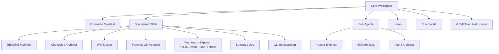

# Architecture

The Gemini Blueprint Workspace utilizes a modular, layer-based architecture designed to decouple core configuration from specialized skills and project-specific logic. This structure ensures high-velocity initialization while maintaining strict adherence to engineering standards.

## Layered Design

The architecture is composed of four primary layers:

1.  **Core Configuration Layer:** Defines the foundational rules, commands, hooks, and environment settings.
2.  **Specialized Skills Layer:** Provides task-specific workflows (e.g., framework experts, semantic ops, changelog maintenance).
3.  **Agent Logic Layer:** Houses the definitions for specialized sub-agents.
4.  **Operational Layer:** Includes scripts and tools for repository maintenance and environment synchronization.

## System Diagram

## Component Breakdown

### Extension Manifest (`gemini-extension.json`)
The central definition file for the workspace extension. It configures the extension's name, version, description, and integrated MCP servers.

### Instruction Tiering (`GEMINI.md`)
Instructions are managed through a hierarchical system:
- **Project Instructions (`./GEMINI.md`):** Team-shared architecture and workflows.
- **Global Personal Memory (`~/.gemini/GEMINI.md`):** Cross-project personal preferences.
- **Private Project Memory (`.gemini/tmp/.../MEMORY.md`):** Machine-specific or private notes.

### Commands & Hooks
- **Commands (`commands/`):** Custom CLI commands like `/audit` defined in TOML, enabling project-wide context ingestion.
- **Hooks (`hooks/`):** Session start triggers defined in `hooks.json` that automate repository synchronization and Git initialization.

### Repository Maintenance
Utilities like `update_repos.py` ensure the workspace remains synchronized with its upstream dependencies, managing clones and fast-forwarding local branches.
